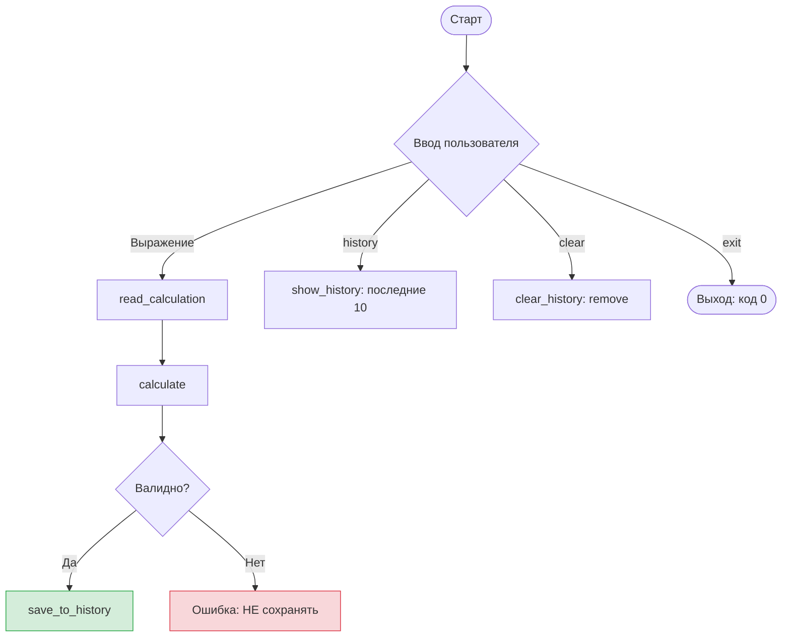

## 🔴 Правило №1
История живёт **только в файле**. Никаких массивов в памяти.

## 📋 Функциональные требования
1. **Пустая строка**: запрос выражения `5 + 3`, вычисление, вывод, **сохранение в `history.txt`** (append).
2. **`history`**: показать последние 10 строк из `history.txt`. Если пусто/нет файла → "History is empty".
3. **`clear`**: удалить `history.txt` (функция `remove`), вывести "History cleared".
4. **`exit`**: выход с кодом 0.

## 🔧 Технические требования
```c
typedef struct {
    int num1;
    int num2;
    char op;
    int result;
} Calculation;

bool read_calculation(Calculation *calc);
int calculate(const Calculation *calc);
bool save_to_history(const char *filename, const Calculation *calc);
void show_history(const char *filename, int last_n);
void clear_history(const char *filename);
char* my_gets(char *str, size_t n, const char *prompt);
```

## ✅ Чек-лист приёмки
- [ ] Компиляция: `gcc -Wall -Wextra -Werror` без ошибок
- [ ] Файл не существует → создаётся при первой записи
- [ ] Файл пустой → выводит "History is empty"
- [ ] 5 записей → показывает все 5
- [ ] 15 записей → показывает **только последние 10**
- [ ] Деление на 0 → ошибка, **НЕ** сохраняется
- [ ] `history` после `clear` → "History is empty"
- [ ] Valgrind: 0 утечек
- [ ] `main` <= 50 строк, нет глобальных переменных
- [ ] Комментарии к каждой функции
- [ ] **Бонус**: нумерация записей (1., 2., 3...)
```

Сохрани: **`Ctrl + S`**

---

## 🚀 Шаг 3: Настрой Split View (разделённый экран)

Это самое важное для удобной работы:

1. Открой файл `TZ.md`
2. Нажми **`Ctrl + K`**, отпусти, затем нажми **`V`** → откроется предпросмотр справа
3. Теперь у тебя слева исходник `TZ.md`, справа — красивый preview
4. Открой файл `main_calc.c` (он у тебя уже есть)
5. **Перетащи вкладку `main_calc.c`** в правую часть экрана, чтобы она оказалась **под** preview `TZ.md`


# 🎯 Single Responsibility: как разделить

## 💡 Главный принцип

**Каждая функция делает ОДНО дело и делает его хорошо.**

Если ты не можешь описать функцию одним коротким предложением без "и" — она делает слишком много.

---

## 🔍 Разбор твоей текущей функции

```c
bool read_calculation(Calculation* st, ...) {
    printf(...);           // 1. Вывод приглашения
    while(true) {          // 2. Цикл повторного ввода
        fscanf(...);       // 3. Чтение и парсинг
        CLEAR_STDIN;       // 4. Очистка буфера
        printf(...);       // 5. Сообщение об ошибке
        if (div by zero)   // 6. Проверка деления на ноль
            printf(...);   // 7. Сообщение о делении на ноль
        else
            return true;   // 8. Возврат результата
    }
}
```

**8 задач в одной функции.** Это слишком.

---

## ✅ Как разделить правильно

### Функция 1: `read_calculation`
**Ответственность:** Только прочитать и распарсить выражение. Ничего больше.

```
Что делает:
- Читает ввод через scanf/fscanf
- Проверяет формат (%d %c %d)
- Очищает stdin при ошибке формата
- Возвращает true если парсинг успешен, false если EOF

Чего НЕ делает:
- НЕ проверяет деление на ноль
- НЕ выводит приглашения
- НЕ управляет циклом повторного ввода
- НЕ выводит сообщения об ошибках
```

### Функция 2: `is_valid_calculation`
**Ответственность:** Только проверить, валидно ли вычисление.

```
Что делает:
- Принимает заполненный Calculation*
- Проверяет деление на ноль
- Возвращает true/false

Чего НЕ делает:
- НЕ читает ввод
- НЕ выводит сообщения
```

### Функция 3: Цикл ввода (в main или отдельной функции)
**Ответственность:** Управлять диалогом с пользователем.

```
Что делает:
- Выводит приглашение
- Вызывает read_calculation
- Если false → просит ввести заново
- Если true → вызывает is_valid_calculation
- Если невалидно → показывает ошибку, просит заново
- Повторяет пока не получит валидные данные
```

---

## 📊 Сравнение

### Было (одна функция):
```
read_calculation:
├── Вывод приглашения
├── Цикл повторного ввода
├── Парсинг
├── Очистка буфера
├── Сообщения об ошибках
├── Проверка деления на ноль
└── Возврат bool
```

### Стало (три функции):
```
main / get_valid_calculation:
├── Вывод приглашения
├── Цикл повторного ввода
├── Вызов read_calculation
├── Вызов is_valid_calculation
└── Сообщения об ошибках

read_calculation:
├── Парсинг
├── Очистка буфера
└── Возврат bool (успех/EOF)

is_valid_calculation:
├── Проверка деления на ноль
└── Возврат bool
```

---

## 💪 Почему это лучше

| Критерий | Одна функция | Три функции |
|---|---|---|
| Тестирование | Нужно тестировать всё вместе | Можно тестировать парсинг отдельно от валидации |
| Переиспользование | Нельзя использовать парсинг без проверки деления | Можно использовать `read_calculation` где угодно |
| Читаемость | 30+ строк, сложно понять | Каждая функция 5-10 строк, имя говорит за себя |
| Изменения | Хочешь поменять сообщение → лезешь в парсинг | Меняешь только в main, парсинг не тронут |
| Отладка | Баг может быть где угодно | Сразу видно: проблема в чтении или в проверке? |

---

## ⚠️ Важное уточнение для учебной задачи

Для **вариации калькулятора** полное разделение может быть избыточным. Допустимый минимум:

```
✅ Обязательно вынести: проверку деления на ноль (отдельная функция или в main)
✅ Обязательно вынести: цикл повторного ввода (в main)
⬜ Опционально: очистку stdin можно оставить в read_calculation
⬜ Опционально: вывод приглашений можно оставить в main
```

**Главное:** `read_calculation` не должна знать про деление на ноль. Это чужая ответственность.

---

## ❓ Вопрос к тебе

Глядя на это разделение:
1. Понятна ли граница между функциями?
2. Можешь ли ты словами описать, что делает каждая из трёх функций?
3. Готов попробовать реализовать?

Не пиши код сразу. Сначала ответь словами. Если понятно — реализуй. Если нет — уточни, что непонятно. 🤔
```
