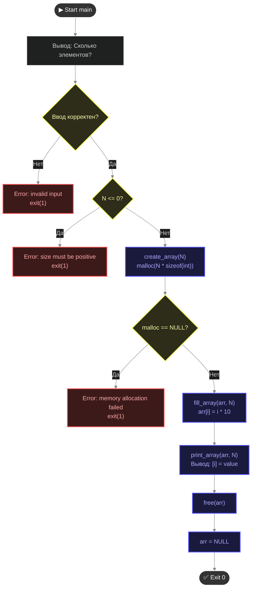

# 📋 ТЗ: Задача 2.1 — Динамический массив

## 🎯 Цель
Написать программу, которая создаёт массив **неизвестного заранее размера**, заполняет его, выводит и корректно освобождает память. Закрепить malloc/free/проверку NULL.

---

## 📝 Функциональные требования

### Основной сценарий
```
1. Программа спрашивает: "Сколько элементов?"
2. Пользователь вводит число N
3. Программа выделяет память под N int'ов через malloc
4. Если malloc вернул NULL → вывести ошибку, завершиться с кодом 1
5. Заполнить массив: arr[i] = i * 10 (то есть 0, 10, 20, 30...)
6. Вывести все элементы в формате: "[0] = 0, [1] = 10, ..."
7. Освободить память через free
8. Завершиться с кодом 0
```

### Обработка ошибок
```
✅ N <= 0 → "Error: size must be positive", exit(1)
✅ malloc вернул NULL → "Error: memory allocation failed", exit(1)
✅ Нечисловой ввод → "Error: invalid input", exit(1)
```

---

## 🔧 Технические требования

### Обязательные функции
```c
// Выделяет память и проверяет NULL
int* create_array(size_t size);

// Заполняет массив по правилу i * 10
void fill_array(int* arr, size_t size);

// Выводит массив
void print_array(const int* arr, size_t size);

// main: чтение N, вызов функций, free
```

### Требования к коду
```
✅ Все указатели после free обнуляются (ptr = NULL)
✅ Никаких глобальных переменных
✅ Комментарии к каждой функции
✅ Компиляция: gcc -Wall -Wextra -Werror
✅ Valgrind: 0 утечек, 0 ошибок
```

---

## ✅ Критерии приёмки

| # | Критерий | Вес |
|---|----------|-----|
| 1 | Компилируется без warning/error | Обязательно |
| 2 | Valgrind чист (0 leaks, 0 errors) | Обязательно |
| 3 | Корректный вывод для N=5 | Обязательно |
| 4 | Обработка N<=0 | Обязательно |
| 5 | Обработка malloc=NULL (можно симулировать) | Обязательно |
| 6 | Разделение на функции | Обязательно |
| 7 | ptr = NULL после free | Обязательно |
| 8 | Коммит в GitHub | Обязательно |

**Все 8 обязательны. Без любого из них задача не засчитана.**

---

## ⏱️ Тайминг (напоминание)

```
Чтение условия:     5 мин  ← ты уже прочитал
Планирование:      10 мин  ← НА БУМАГЕ, без кода
Код:               40-50 мин
Valgrind:          10 мин
Коммит:             5 мин
─────────────────────────
ИТОГО:             ~70 мин максимум
```

Если не укладываешься в 70 минут → **СТОП**. Коммить что есть, писать мне честно. Не растягивать.

---

## 💡 Подсказки (без кода)

-   `create_array` возвращает указатель или NULL. Проверка в main.
-   `fill_array` и `print_array` принимают `const` где возможно.
-   Размер для malloc: `size * sizeof(int)`, НЕ просто `size`.
-   Для тестирования malloc=NULL можно временно заменить malloc на функцию, которая всегда возвращает NULL.

---

## 🚫 Запрещено

```
❌ Использовать calloc вместо malloc (задача про malloc)
❌ Использовать VLA (int arr[n]) — это не динамическая память
❌ Копировать готовое решение из интернета
❌ Превышать 70 минут
```

---
💡 Советы для укладывания в 70 минут:
- Не пиши main первым. Начни с реализации create_array, fill_array, print_array. Когда они готовы и скомпилированы без warning'ов, собери их в main за 5 минут.

- Проверка ввода: используй возвращаемое значение scanf. Если scanf("%zu", &n) != 1, значит ввели не число → чистим буфер ввода и exit(1).
- Valgrind: запускай сразу после написания: valgrind --leak-check=full ./your_program. Если видит 0 ошибок — сразу делай коммит.
- Симуляция malloc=NULL: для проверки создай ветку или временно измени строку на int* arr = NULL; вместо malloc, чтобы убедиться, что твоя обработка ошибки работает.

Удачи! Таймер запущен. Если что-то пойдёт не так — стопори и коммить промежуточный результат. Ты справишься! 💪
