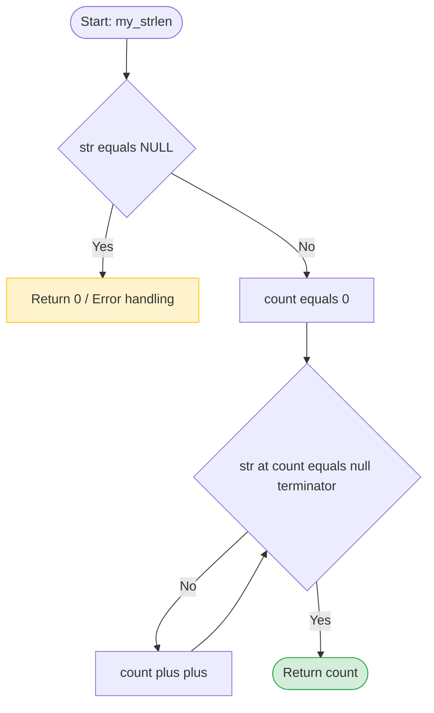

📋 Функциональные требования
Функция принимает указатель на строку (const char *).
Функция возвращает количество символов до встреченного нуль-терминатора \0.
Тип возвращаемого значения: size_t (беззнаковый целочисленный тип, стандарт для размеров).
Функция не должна модифицировать исходную строку (поэтому const).
🔧 Технические требования
Сигнатура функции

#include <stddef.h> // Для size_t

size_t my_strlen(const char *str);

Допустимые подходы (выбери один и обоснуй в комментарии):
Вариант А (Индексы): while (str[i] != '\0') { i++; }
Вариант Б (Указатели): while (*str != '\0') { str++; count++; } (более "C-шный" путь)
🧪 Граничные случаи (Edge Cases) — обязательно протестировать!
NULL-указатель: my_strlen(NULL) → должна вернуть 0 (или вызвать assert, но возврат 0 безопаснее для начала).
Пустая строка: my_strlen("") → должна вернуть 0.
Один символ: my_strlen("a") → должна вернуть 1.
Обычная строка: my_strlen("hello") → должна вернуть 5.
Строка с пробелами и спецсимволами: my_strlen("hello world!\n") → должна вернуть 13 (пробелы и \n считаются символами).
✅ Чек-лист приёмки (кликай по мере выполнения!)
Обязательные критерии
Компиляция: gcc -Wall -Wextra -Werror -pedantic без единого предупреждения
Функция имеет точную сигнатуру: size_t my_strlen(const char *str)
Нет #include <string.h> в коде
Обработан случай с NULL (программа не падает с Segmentation Fault)
Написан main.c с тестами для всех 5 граничных случаев выше
Valgrind показывает 0 ошибок и 0 утечек (даже если их тут быть не должно, привыкаем проверять)
Функция main не превышает 30 строк (вынеси тесты в отдельную функцию run_tests())
К функции my_strlen написан Doxygen-стиль комментарий (что делает, @param, @return)
Бонусные критерии (для 100%)
Реализовано через арифметику указателей (без квадратных скобок [])
В run_tests() используется макрос #define TEST(str, expected) для сокращения кода тестов
Коммит в GitHub: feat: implement custom my_strlen with NULL handling and tests
💡 Заметки для планирования
Вспомнить: что такое \0 и чем он отличается от символа '0'.
Вспомнить: почему для длины строки используется size_t, а не int.
Написать тесты на бумаге перед кодированием.

---

### 🚀 Твой план действий на ближайшие 30 минут (как в ТЗ):

1. **Создай файл** `strlen_TZ.md` в VS Code и вставь туда этот текст.
2. **Открой предпросмотр** (`Ctrl + Shift + V`), чтобы видеть схему и чекбоксы.
3. **Создай файл** `my_strlen.c`.
4. **Напиши на бумаге или в комментариях**:
   - Как ты будешь проверять `NULL`?
   - Какой цикл ты выберешь (while с индексом или while с указателем)?
5. **Напиши функцию `run_tests()`** с 5-ю вызовами твоей функции и проверкой через `if (result != expected)`.

Как только будешь готов написать первую строку кода или если возникнет вопрос по граничным случаям (например, "а что если строка состоит только из пробелов?") — пиши. Мы разберём это до того, как ты начнёшь кодить.