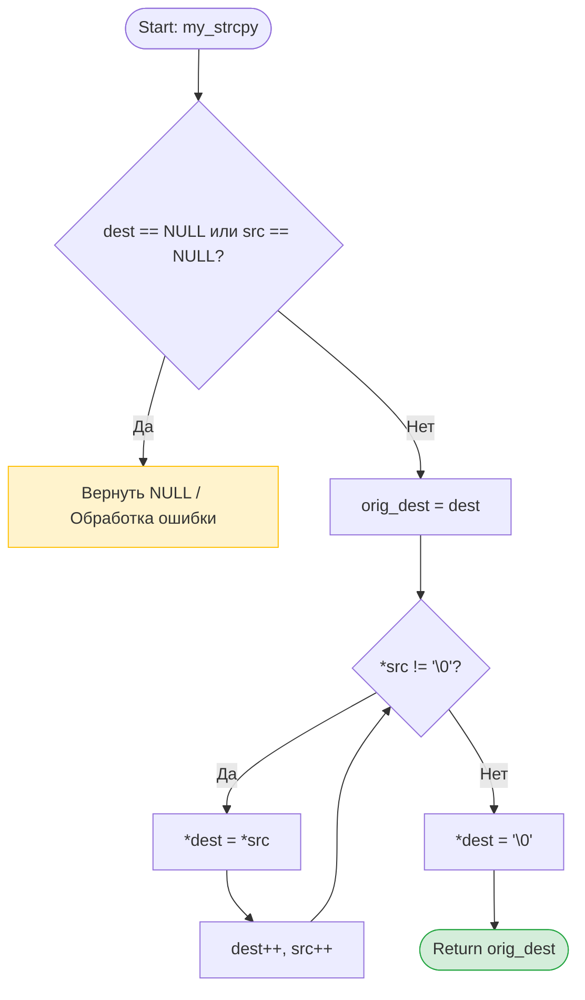

📋 Функциональные требования
Функция копирует строку, на которую указывает src, в массив, на который указывает dest, включая завершающий нуль-терминатор \0.
Функция возвращает исходный указатель на dest (это позволяет использовать функцию в цепочках, например, printf("%s", my_strcpy(a, b))).
Исходная строка src не модифицируется (const char *).
Строка назначения dest модифицируется (char *).
🔧 Технические требования
Сигнатура функции
#include <stddef.h> // Для NULL

char* my_strcpy(char* dest, const char* src);
Допустимые подходы (выбери один и обоснуй в комментарии):
Вариант А (Индексы): while (src[i] != '\0') { dest[i] = src[i]; i++; } dest[i] = '\0';
Вариант Б (Указатели): while ((*dest++ = *src++) != '\0'); (классический идиоматичный C, но требует аккуратности с сохранением исходного dest для возврата!)
🧪 Граничные случаи (Edge Cases) — обязательно протестировать!
NULL-указатели: my_strcpy(NULL, "test") или my_strcpy(dest, NULL) → должна вернуть NULL (и не упасть).
Пустая строка: my_strcpy(dest, "") → должна скопировать только \0 и вернуть dest.
Обычная строка: my_strcpy(dest, "hello") → корректное копирование 6 байт (включая \0).
Переполнение буфера (теоретически): в тестах убедись, что массив dest достаточно велик (например, char dest[50]), чтобы избежать Undefined Behavior.
✅ Чек-лист приёмки (кликай по мере выполнения!)
Обязательные критерии
Компиляция: gcc -Wall -Wextra -Werror -pedantic без единого предупреждения
Функция имеет точную сигнатуру: char* my_strcpy(char* dest, const char* src)
Нет #include <string.h> в коде
Обработан случай с NULL (программа не падает с Segmentation Fault, возвращает NULL)
Функция возвращает именно начальный адрес dest, а не сдвинутый
Написан main.c с тестами для всех граничных случаев выше
Valgrind показывает 0 ошибок и 0 утечек
Функция main не превышает 30 строк (тесты вынесены в run_tests())
К функции написан Doxygen-стиль комментарий (@param, @return)
Бонусные критерии (для 100%)
Реализовано через арифметику указателей (Вариант Б)
В run_tests() используется макрос #define TEST_STRCPY(dest, src, expected_str) для проверки
Коммит в GitHub: feat: implement custom my_strcpy with NULL handling and pointer arithmetic
💡 Заметки для планирования
Вспомнить: почему нельзя вернуть dest, если мы делали dest++ в цикле? (Нужна переменная-сохранялка char *orig = dest).
Вспомнить: условие цикла while ((*dest++ = *src++) != '\0') одновременно копирует, сдвигает указатели и проверяет на \0.
Написать тесты на бумаге перед кодированием.

---

### 🚀 Твой план действий на ближайшие 30 минут:

1. **Создай файл** `strcpy_TZ.md` в VS Code и вставь туда этот текст.
2. **Открой предпросмотр** (`Ctrl + Shift + V`).
3. **Создай файл** `my_strcpy.c`.
4. **Напиши на бумаге или в комментариях**:
   - Как ты сохранишь начальный адрес `dest` для возврата?
   - Как ты проверишь `NULL` для *обоих* указателей?
5. **Подготовь макрос для тестов**, который будет проверять не только возвращаемый указатель, но и содержимое строки `dest` после копирования (можно использовать твой уже готовый `my_strlen` для проверки длины, или простое посимвольное сравнение, раз `strcmp` пока нельзя).

Как только будешь готов написать первую строку кода или если возникнет вопрос по сохранению указателя `dest` — пиши. Мы разберём это до того, как ты начнёшь кодить. 💪