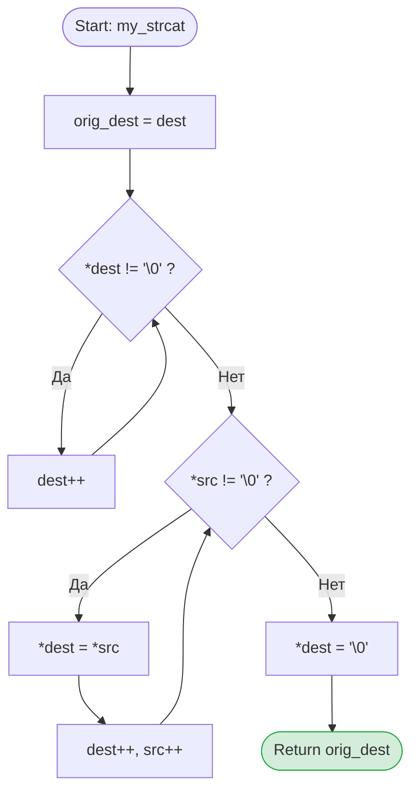

# 🎯 ТЗ: Задача 2.4 — Собственная реализация `strcat` (C)

## 🔴 Правило №1: Строгие ограничения
1. Категорически запрещено использовать `#include <string.h>` или стандартную `strcat()`.
2. **ЗАПРЕЩЕНО делать проверки на NULL** внутри функции. Мы строго имитируем поведение стандартной `strcat` (передача NULL ведёт к Segmentation Fault, и это нормально).

## 🗺 Блок-схема логики
📋 Функциональные требования
Функция добавляет (дописывает) копию строки src в конец строки dest.
Первый символ src перезаписывает нуль-терминатор \0 в конце dest.
Функция возвращает исходный указатель на dest (для цепочек вызовов).
Вызывающий код гарантирует, что в массиве dest достаточно места для размещения результирующей строки.
🔧 Технические требования
Сигнатуры функций (нужны ОБЕ реализации)

// Вариант А: Индексная реализация
char* my_strcat_idx(char* dest, const char* src);

// Вариант Б: Указательная реализация (идиоматичный C)
char* my_strcat_ptr(char* dest, const char* src);

Ключевые моменты реализации:
Индексная: Сначала цикл while (dest[i] != '\0') i++;, затем цикл while (src[j] != '\0') { dest[i] = src[j]; i++; j++; }, и в конце dest[i] = '\0';.
Указательная: Сначала while (*dest) dest++;, затем while ((*dest++ = *src++)); (этот цикл сам скопирует \0 и остановится).
🧪 Граничные случаи (Edge Cases) — обязательно протестировать!
Пустая src: my_strcat(dest, "") → dest не должна измениться (кроме того, что её \0 будет перезаписан и сразу же восстановлен).
Пустая dest: dest изначально "", src = "hello" → результат должен быть "hello".
Обычное сцепление: dest = "hello", src = " world" → результат "hello world".
Достаточность буфера: в тестах всегда объявляй dest с запасом (например, char dest[50] = "hello";), чтобы избежать переполнения стека.
✅ Чек-лист приёмки (кликай по мере выполнения!)
Обязательные критерии
Компиляция: gcc -Wall -Wextra -Werror -pedantic без единого предупреждения
В коде НЕТ #include <string.h>
В коде НЕТ проверок if (dest == NULL) или if (src == NULL)
Реализованы ОБЕ версии: my_strcat_idx и my_strcat_ptr
Обе функции возвращают именно начальный адрес dest
Написан main.c с тестами для всех граничных случаев выше
Valgrind показывает 0 ошибок и 0 утечек
Функция main не превышает 30 строк (тесты вынесены в run_tests())
К функциям написан Doxygen-стиль комментарий (@param, @return)
Бонусные критерии (для 100%)
В run_tests() используется макрос #define TEST_STRCAT(initial_dest, src, expected)
Коммит в GitHub: feat: implement my_strcat (index & pointer versions) without NULL checks
💡 Заметки для планирования
Вспомнить: почему в указательной версии while ((*dest++ = *src++)); нам не нужно отдельно дописывать \0 в конце? (Подсказка: условие цикла проверяет значение после присваивания).
Вспомнить: зачем нам переменная char *orig = dest; в самом начале функции?
Подготовить макрос для тестов, который будет проверять результат через уже написанную тобой my_strlen или посимвольно.