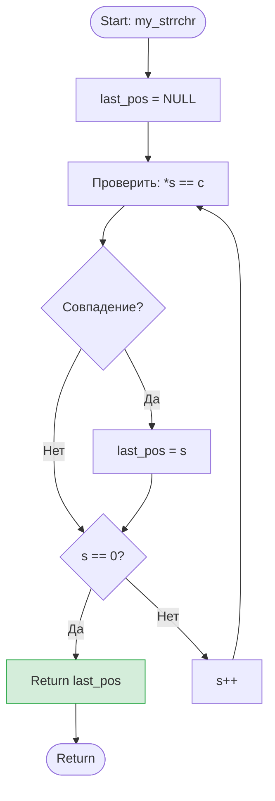

📋 Функциональные требования
Функция ищет последнее вхождение символа c в строке s.
Возвращает указатель на этот символ. Если символ не найден, возвращает NULL.
Важный нюанс: Завершающий ноль \0 считается частью строки. Если ищется \0, функция обязана вернуть указатель на него.
Параметр c имеет тип int (как в стандарте C), но сравниваться должен как char.
🔧 Технические требования

Сигнатура функции
char *my_strrchr(const char *s, int c);

Допустимые подходы (выбери один и обоснуй в комментарии):
Вариант А (Индексный, два прохода): Сначала найти длину строки (или дойти до \0), затем идти циклом for назад от конца к началу, пока не найдём совпадение.
Вариант Б (Указательный, один проход): Идти от начала до конца, каждый раз при совпадении обновляя указатель last_pos. Цикл должен проверить символ, обновить last_pos, и только потом проверить, не был ли это \0, чтобы прерваться. (Рекомендуемый, более элегантный путь).
🧪 Граничные случаи (Edge Cases) — обязательно протестировать!
Символ в середине (дубликаты): поиск 'l' в "Hello" → должен вернуть указатель на вторую 'l' (индекс 3).
Символ отсутствует: поиск 'z' в "Hello" → должен вернуть NULL.
Поиск \0: поиск '\0' в "Hello" → должен вернуть указатель на \0 (индекс 5).
Пустая строка + поиск \0: поиск '\0' в "" → должен вернуть указатель на начало строки (индекс 0).
✅ Чек-лист приёмки (кликай по мере выполнения!)
Обязательные критерии
-Компиляция: gcc -Wall -Wextra -Werror -pedantic без единого предупреждения
-В коде НЕТ #include <string.h>
-Функция имеет точную сигнатуру: char *my_strrchr(const char *s, int c)
-Приведение типа (char)c используется при сравнении
-Проходит все 4 граничных случая (особенно поиск \0!)
-Написан main.c с функцией run_tests()
-Valgrind (valgrind --leak-check=full ./my_strrchr) показывает 0 ошибок и 0 утечек
-Функция main не превышает 30 строк
-К функции написан Doxygen-стиль комментарий (@param, @return)

Бонусные критерии (для 100%)

-Реализован Вариант Б (указательный, один проход с do-while или while(1))
-В run_tests() используется макрос #define TEST_RCHR(str, ch, expected_desc) для удобного вывода
-Коммит в GitHub: feat: implement my_strrchr with null-terminator handling
💡 Заметки для планирования

-Вспомнить: почему int c нужно приводить к (char) при сравнении? (Подсказка: promotion типов и сравнение байтов).
-Вспомнить: как написать цикл, который проверяет условие после выполнения тела, чтобы успеть обработать \0? (Подсказка: -do { ... } while (*s++ != '\0'); или while (1) { ... if (*s == '\0') break; s++; }).
-Как макрос будет проверять, что вернулся именно NULL, а не валидный указатель?
---

### 🚀 Твой план действий на ближайшие 30 минут:

1. **Создай файл** `strrchr_TZ.md` в VS Code и вставь туда этот текст.
2. **Открой предпросмотр** (`Ctrl + Shift + V`).
3. **Создай файл** `my_strrchr.c`.
4. **Напиши на бумаге или в комментариях**:
   - Как будет выглядеть цикл, который гарантированно проверит `\0` и запомнит его, если мы ищем именно его?
   - Как в макросе теста отличить ситуацию, когда функция вернула `NULL`, от ситуации, когда она вернула валидный указатель?
5. **Начни с написания `run_tests()`** и макроса, чтобы чётко видеть, что именно ты проверяешь.

Как только будешь готов писать код или если возникнет вопрос по логике цикла (это самый тонкий момент в этой задаче) — пиши. Мы разберём это до того, как ты начнёшь кодить. 💪